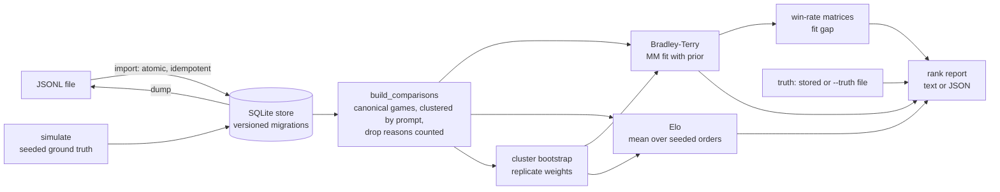

# PrefPairs

[](https://github.com/vipul21435/prefpairs/actions/workflows/ci.yml)

RLHF preference-data toolkit: store pairwise judgments with full provenance,
generate synthetic data with known ground truth, and rank models or responses
with Bradley-Terry and Elo plus cluster-bootstrap confidence intervals, then
check the ranking against the truth.

> Status: slices 1 and 2 of 8 are done (data model and store, simulator,
> aggregation with intervals, the `rank` command), plus a Docker image and an
> end-to-end `make demo`. Annotator quality checks, a collection UI and
> DPO/KTO/reward-model export are **not built yet**; they are listed under
> [Roadmap](#roadmap) and specified in [PLAN.md](PLAN.md).

## Why this exists

Preference data is only as good as the people and processes that produce it.
The expensive failures are quiet ones: an annotator who always picks the left
response, a reviewer who rewards length rather than quality, or a "winner" whose
lead disappears once you put a confidence interval on it. PrefPairs treats each
of those as a testable hypothesis with a named statistic, and it proves every
statistic on simulated data where the right answer is known before trusting it
on real data.

The design comes from hands-on post-training data work: running review
workflows and rubric-driven evaluation for LLM datasets (RLHF and SFT) at
scale, and building verifiable benchmark tasks where every grader is
deterministic and every number is reproducible.

## What works today

| Stage | What it does | Method | Command |
| --- | --- | --- | --- |
| Schema and store | Prompts, candidate responses with provenance, pairwise and ranked judgments, rationales, annotator sessions, gold pairs | pydantic v2 models over SQLite with versioned migrations, foreign keys and triggers | `init`, `import`, `dump`, `stats` |
| Simulate | Synthetic data with known model strengths and annotators with planted noise and bias | seeded generative model with analytic choice probabilities | `simulate` |
| Aggregate | Ranking of models or responses with uncertainty | Bradley-Terry (MM algorithm, numpy only), Elo averaged over seeded game orders, prompt-level cluster bootstrap, percentile intervals for values and ranks, empirical vs predicted win rates | `rank` |
| Package | Reproducible runtime and demo | digest-pinned `python:3.12-slim`, uv, non-root user | `make demo`, `make docker-demo` |

## Quickstart

Requires [uv](https://docs.astral.sh/uv/), Git and make.

```bash
git clone https://github.com/vipul21435/prefpairs.git && cd prefpairs
uv sync --frozen        # Python 3.12 venv from uv.lock
make demo               # import bundled sample, stats, rank with CIs, check recovery
make check              # ruff, mypy --strict, pytest with branch coverage
```

These commands were run in a fresh clone; `make demo` ends with
`demo OK: both rankings recover the true model order`. With Docker instead of uv:

```bash
docker build -t prefpairs . && docker run --rm --entrypoint sh prefpairs scripts/demo.sh
```

## CLI

| Command | Purpose |
| --- | --- |
| `prefpairs init --db PATH` | create a database or migrate it to the current schema |
| `prefpairs import FILE --db PATH` | atomic, idempotent JSONL import |
| `prefpairs simulate --seed N --db PATH [--roster reliable=6,left_biased=1] [--truth-out truth.json]` | write a simulated dataset and its ground truth |
| `prefpairs stats --db PATH [--json]` | record counts, choice and pair-kind mix, per-model responses, annotator load |
| `prefpairs dump --db PATH [--out FILE]` | canonical JSONL of every record |
| `prefpairs rank --db PATH [--method bt\|elo] [--level model\|response] [--replicates N] [--resample prompt\|judgment] [--confidence 0.95] [--prior 0.1] [-x ANNOTATOR ...] [--include-ranked] [--truth FILE] [--json]` | ranking with bootstrap intervals, fit gap, and Kendall tau against the truth when it is known |
| `prefpairs info` | version and which pipeline stages are available |

`--db` defaults to `.prefpairs/prefpairs.db` and can be set with `PREFPAIRS_DB`.

### Sample output

The bundled sample (`examples/sample.jsonl`, with its ground truth in
`examples/sample-truth.json`) is the canonical dump of `prefpairs simulate
--seed 0`; `tests/test_examples.py` regenerates it and compares byte for byte.
It holds 40 prompts, 6 models, 12 annotators (4 of them planted as defective)
and 672 pairwise judgments. Output of `make demo`, copied from a real run:

```text
$ prefpairs rank --truth examples/sample-truth.json
Bradley-Terry ranking of 6 models from 473 games on 40 prompts
95% intervals from 500 prompt-bootstrap replicates (seed 0)
not counted: pair_kind 192, skip 7

rank  model    log-strength          95% CI          rank range    score  games  true rank
   1  model-a         1.128  [   0.805,    1.519]  1-2           128.5    167          1
   2  model-f         1.011  [   0.672,    1.362]  1-2           119.5    163          2
   3  model-b         0.207  [  -0.059,    0.495]  3-3            94.5    174          3
   4  model-e        -0.396  [  -0.709,   -0.122]  4-5            55.0    141          4
   5  model-d        -0.743  [  -1.075,   -0.451]  4-6            41.5    125          5
   6  model-c        -1.206  [  -1.562,   -0.907]  5-6            34.0    176          6

fit gap (mean |empirical - predicted| win rate on played pairs): 0.061
true order: model-a > model-f > model-b > model-e > model-d > model-c
Kendall tau against the true order: 1.000

$ prefpairs rank --method elo -x ann-06 -x ann-08 -x ann-10 -x ann-11 --truth examples/sample-truth.json
Elo ranking of 6 models from 315 games on 40 prompts
95% intervals from 500 prompt-bootstrap replicates (seed 0)
not counted: excluded_annotator 160, pair_kind 192, skip 5
excluded annotators: ann-06, ann-08, ann-10, ann-11

rank  model      Elo rating          95% CI          rank range    score  games  true rank
   1  model-a      1116.093  [1090.640, 1144.558]  1-2            96.0    109          1
   2  model-f      1101.265  [1071.350, 1126.776]  1-2            88.5    106          2
   3  model-b      1013.912  [ 982.342, 1045.025]  3-4            63.5    118          3
   4  model-e       965.255  [ 936.954,  995.015]  3-5            36.0     96          4
   5  model-d       948.560  [ 920.095,  980.086]  4-5            25.0     82          5
   6  model-c       854.915  [ 832.405,  877.923]  6-6             6.0    119          6

true order: model-a > model-f > model-b > model-e > model-d > model-c
Kendall tau against the true order: 1.000
```

How to read it: both methods recover the true order, but the rank ranges say
the data cannot separate `model-a` from `model-f` (each is first in some
replicates), so a report that crowned `model-a` outright would overclaim.
`score` counts a tie as half a point; `games` counts each game once per side.
Gold and control pairs are quality checks, not extra evidence, so they are
left out (`pair_kind 192`), and skips carry no preference.

## Architecture



| Module | Responsibility |
| --- | --- |
| `schema.py` | immutable pydantic records and validation rules |
| `store.py` | SQLite repository, migrations via `PRAGMA user_version`, dependency-ordered import |
| `jsonl.py` | tagged JSONL reading and canonical writing |
| `simulate.py` | ground-truth generator and annotator archetypes |
| `aggregate/comparisons.py` | judgments to games (`ComparisonSet`), with every dropped judgment counted by reason |
| `aggregate/bradley_terry.py` | batched MM fit, identifiability check, synthetic sampler |
| `aggregate/elo.py` | vectorised Elo replay over many game orders at once |
| `aggregate/bootstrap.py` | prompt or judgment resampling, percentile intervals, rank intervals |
| `aggregate/winrate.py` | empirical and model-implied win-rate matrices |
| `ranking.py` | the `rank` report and Kendall tau |
| `cli.py` | Typer commands |

## Measured numbers

Every number below comes from a command run on this repository (Apple Silicon
laptop, Python 3.12).

| What | Result | Reproduce |
| --- | --- | --- |
| Tests | 292 passed | `make cov` |
| Branch coverage | 99.91% (gate: 85%) | `make cov` |
| Ranking recovery on the bundled sample | Kendall tau 1.000 for Bradley-Terry and for Elo | `make demo` |
| End-to-end demo wall time | about 1.1 s | `time make demo` |
| One `rank` with 500 bootstrap replicates | about 0.2 s | `time uv run prefpairs rank --db .prefpairs/demo.db` (after `make demo`) |
| Docker image size | 327 MB | `make docker && docker image ls prefpairs:local` |

Statistical properties are pinned by tests rather than quoted: the
Bradley-Terry score equations hold at the solution and the log-likelihood never
decreases (`tests/test_bradley_terry.py`); averaged Elo does not depend on the
stored order of judgments (`tests/test_elo.py`); bootstrap intervals shrink
roughly as one over root n, 95% intervals cover the true strengths in 85% to
100% of 200 cases drawn from the model, and prompt-level resampling widens
intervals when judgments on a prompt are correlated
(`tests/test_bootstrap.py`).

## Design decisions

- **numpy is the only numeric dependency.** Bradley-Terry, Elo and the
  bootstrap are written directly on numpy, with no scipy, pandas or torch: the
  point is to show the statistics, and the image stays small.
- **Canonical pair orientation.** A judgment stores what the annotator saw
  (left, right, choice). Analysis orients every game by sorted item id, so
  position effects and content effects stay separable.
- **Ties are half a win; skips are dropped.** Every dropped judgment is counted
  by reason and printed, so a ranking says what it ignored.
- **Identifiability is explicit.** The plain Bradley-Terry MLE exists only when
  the comparison graph is strongly connected. The default adds a small
  pseudo-count prior (0.1 virtual games against a reference item); with
  `--prior 0` a disconnected graph, or a disconnected bootstrap replicate, is an
  error instead of a silently divergent fit.
- **Cluster bootstrap by default.** Judgments on the same prompt are
  correlated, so replicates resample prompts and keep every judgment of a drawn
  prompt. `--resample judgment` is available for comparison and gives narrower,
  overconfident intervals on correlated data (a test demonstrates this).
- **Rank intervals, not only value intervals.** Each replicate is ranked, so the
  report can say "first or second" instead of implying a strict order.
- **Elo is averaged over seeded game orders.** A single Elo pass depends on the
  replay order, which is noise for a static pool of models.
- **Determinism.** Every random choice goes through a seeded
  `numpy.random.Generator`; the same seed gives the same database, dump and
  report, and the bundled sample is regenerated byte for byte in a test.
- **Integrity in the database as well as in Python.** Composite foreign keys
  tie a judgment's responses to its prompt, a trigger requires a control to
  repeat an earlier judgment of the same annotator on the same pair, and
  judgments are append-only.

## Data model

All records are immutable pydantic models (`src/prefpairs/schema.py`) and are
validated again by SQLite constraints when stored (`src/prefpairs/store.py`).

| Record | Key fields | Rules enforced |
| --- | --- | --- |
| `Prompt` | `id`, `text`, `category`, `tags` | slug ids, non-blank text |
| `Response` | `prompt_id`, `model`, `text`, `provenance` (source, generator, decoding params, timestamp, origin) | response belongs to an existing prompt |
| `Annotator`, `Session` | `kind`, `client`, `started_at`, `ended_at` | UTC-aware timestamps, session cannot end before it starts |
| `PairwiseJudgment` | displayed `left_response_id` / `right_response_id`, `choice` (left, right, tie, skip), `pair_kind` (regular, control, gold), `repeat_of`, `rationale`, `latency_ms` | both responses belong to the judgment's prompt, the session belongs to the annotator, a control must repeat an earlier judgment of the same annotator on the same pair, rationale capped at 2000 chars, judgments are append-only |
| `RankedJudgment` | `shown` order and `ranking` (best first) | the ranking is a permutation of what was shown |
| `GoldPair` | `better_response_id`, `worse_response_id`, `reason` | unique per pair in either orientation |

The schema version lives in `PRAGMA user_version`; each migration runs in one
transaction with its version bump, so a failed upgrade leaves the file
untouched. Opening a database written by a newer version, or a SQLite file that
is not a PrefPairs store, is refused.

### JSONL import and export

One JSON object per line, tagged with `type`. A prompt may carry its responses
inline, the usual shape of a generation dump. Two lines from
[`examples/tiny.jsonl`](examples/tiny.jsonl), shortened:

```json
{"type":"prompt","id":"p2","text":"Give one tip for writing a clear commit message.","responses":[{"id":"p2-a","model":"model-a","text":"Start with a short imperative summary line.","provenance":{"source":"model"}},{"id":"p2-b","model":"model-b","text":"Write good messages.","provenance":{"source":"model"}}]}
{"type":"pairwise","id":"j2","session_id":"ann-1-s1","annotator_id":"ann-1","prompt_id":"p2","left_response_id":"p2-a","right_response_id":"p2-b","choice":"left","pair_kind":"gold","created_at":"2026-03-02T09:00:30Z"}
```

```bash
uv run prefpairs import examples/tiny.jsonl --db .prefpairs/tiny.db
# added prompt 2, response 5, annotator 2, session 2, gold 1, pairwise 5, ranked 1; 0 unchanged
uv run prefpairs import examples/tiny.jsonl --db .prefpairs/tiny.db
# added nothing; 18 unchanged
```

Import is atomic and idempotent: records are inserted in dependency order,
unchanged records are skipped, and a record that conflicts with stored data or
breaks a reference aborts the whole file with the line number or record id.
`dump` writes canonical JSONL (sorted keys, ASCII) that re-imports into an
identical database.

## Synthetic ground truth

`prefpairs.simulate` generates data whose truth is known, so each statistic can
be tested for what it is supposed to find:

- Each model has a latent log-strength (evenly spaced, randomly assigned to
  names); a response's quality is its model's strength plus noise.
- Response length is log-normal with a per-model verbosity offset whose
  correlation with strength is set exactly (0 by default), so a quality
  preference cannot pass for a length preference by chance.
- An annotator skips, ties (more often on close pairs), or picks left with
  probability `sigmoid(beta * quality_gap + position_bias + length_weight * log_length_ratio)`.
  `AnnotatorProfile.choice_probabilities` returns this distribution exactly,
  and the tests check every simulated annotator's left-choice count against it.
- Work is scheduled like a real project: each pair is judged by several
  annotators with balanced load, everyone sees the gold pairs, and a share of
  each annotator's pairs comes back later as a control with the sides flipped.

| Archetype | beta | position bias | length weight | Should be flagged by the (planned) audit |
| --- | --- | --- | --- | --- |
| reliable | 3.0 | 0 | 0 | no |
| noisy | 0.9 | 0 | 0 | no (down-weighted, not flagged) |
| left_biased | 2.0 | +2.0 | 0 | yes |
| length_biased | 1.0 | 0 | 3.0 | yes |
| random_spammer | 0 | 0 | 0 | yes |
| adversarial | -2.0 | 0 | 0 | yes |

## Development

| Command | Purpose |
| --- | --- |
| `make lint` | `ruff check` and `ruff format --check` |
| `make typecheck` | `mypy --strict` over `src/` |
| `make test` | `pytest -q` |
| `make cov` | tests with branch coverage, fails under 85% |
| `make check` | all of the above (what CI runs) |
| `make demo` | end-to-end demo on the bundled sample |
| `make docker` / `make docker-demo` | build the image (label `project=prefpairs`, dangling layers pruned) / run the demo in it |

CI runs lint, strict typing and the test suite with coverage, and in a second
job builds the Docker image and runs the demo inside it. Python 3.12, `src/`
layout, dependencies pinned in `uv.lock`. No GPU, network service or paid API
is needed.

## Roadmap

Not built yet, in the order of [PLAN.md](PLAN.md):

- **Annotator bias and agreement checks (slice 3):** exact binomial test for
  position bias with Holm-Bonferroni, logistic regression for length bias,
  Cohen and Fleiss kappa, self-consistency on control repeats.
- **Transitivity, spammer detection and `prefpairs audit` (slice 4):** cycle
  counts in per-annotator preference graphs, gold accuracy, Dawid-Skene EM, and
  a per-annotator report that must flag exactly the planted annotators.
- **Collection (slice 5):** a seeded pair scheduler with control and gold
  injection, a terminal `annotate` loop and a small server-rendered web UI.
- **Export (slice 6):** vote aggregation with filters, DPO, KTO and
  reward-model JSONL with leak-free prompt-level splits, and a dataset card.
- **Packaging (rest of slice 7):** a compose file with the web UI and a
  pipeline service.
- **Benchmarks and docs (slice 8):** recovery versus judgment budget, interval
  coverage, audit detection power, fit time, and a methods document.
- **Known limitation:** `rank --level response` fits dense item-by-item
  matrices for every bootstrap replicate. On the 199 compared responses of the
  sample, `uv run prefpairs rank --db .prefpairs/demo.db --level response
  --replicates 20` took 13 to 19 s over two runs, so a sparse fit is planned.

## License

MIT. See [LICENSE](LICENSE).
